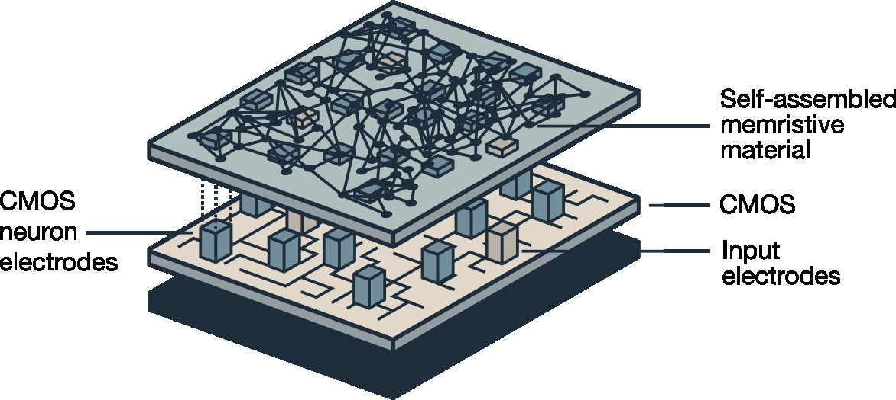

# Fused-MemBrain

  

<em>Figure from Cipollini et. al., 2025 Neuromorph. Comput. Eng. 5 024002.</em>

This repository contains the code relative to the paper
**Cipollini et al. 2025 Neuromorph. Comput. Eng. 5 024002
DOI: 10.1088/2634-4386/adc6b5, URL: https://iopscience.iop.org/article/10.1088/2634-4386/adc6b5**

The script [fusedmembrain.py](spike_memnet/fusedmembrain.py) reproduces the figures in the paper. 
It can be used to evaluate the compatibility of self-assembled materials with the hardware description provided in the paper. 

The script [dynamics_run_heterogenous_sample.py](mem_net/dynamics_run_heterogeneous_sample.py) showcases the simulation
of the memristive material (plexus) only. 
The script uses heterogeneous topology rather than the 2d grid network used in the paper.
The script [dynamics_run_grid_sample_pulse_signal.py](mem_net/dynamics_run_grid_sample_pulse_signal.py) instead shows the application 
of a pulse to a grid-graph network with random non-overlapping diagonals. The mentioned script also compares an equivalent resistor network. 
Note that in the latter script parameters are distinct from the one showcasing the heterogeneous case.

### Set the environment
pip -r requirements.txt

Tested for python 3.11

